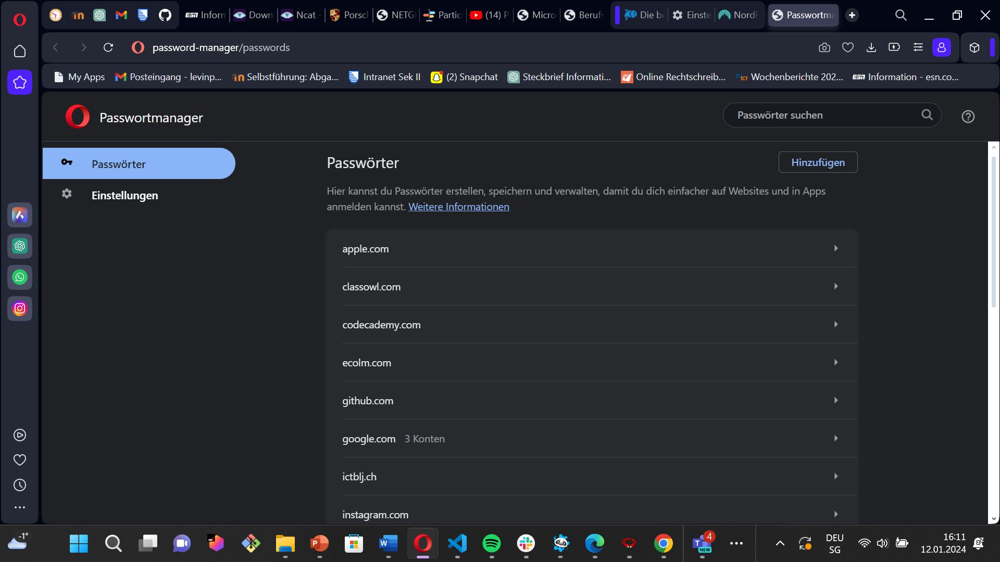

# Arbeitsjournal – 17.11.2023

## Was habe ich heute gelernt?
Unterschied zwischen Datenschutz und Datensicherheit:
Datenschutz zielt darauf ab, die Privatsphäre von Individuen zu wahren, indem sichergestellt wird, dass deren persönliche Daten nicht unerlaubt abgerufen werden. Auf der anderen Seite fokussiert sich Datensicherheit darauf, sicherzustellen, dass Daten vor unbefugtem Zugriff geschützt sind.

# Erfolge/Misserfolge:
Am heutigen Tag erfolgte der Einstieg in das neue Modul 231. Ich stiess auf diverse Herausforderungen, da mir noch nicht klar war, wie man Gitlab nutzt und Daten über die Befehlszeile (CMD) hochlädt. Dennoch gelang es mir, meinen Gitlab-Account einzurichten und die relevanten neuen Befehle in Git zu erlernen.

    

## Arbeitsjournal – 24.11.2023

# Was habe ich heute gelernt?
An diesem Freitag schauten wir uns Gitlab an und wie man Datein in Gitlab überträgt. Dabei schauten wir uns auch Branchis in Git an. 

# Erfolge/Misserfolge:
Heute habe ich gute Fortschritte gemacht, indem ich mich auf die Erledigung der Aufgaben der Hausaufgaben 2a konzentriert habe. Dabei habe ich gelernt, wie man Daten im CMD zu GitLab überträgt, was Branches sind und wie man Bilder sowie Verlinkungen in GitLab erstellt.

## Arbeitsjournal - 08.12.2023

# Was habe ich heute gelernt:
Heute erhielt ich einen Einblick in das Datenschutzgesetz und die darin enthaltenen Regelungen.

# Erfolge/Misserfolge:
Der heutige Nachmittag verging rasch. Ich machte gute Fortschritte und erledigte meine Hausaufgaben bereits in einer Gruppe. Die Aufgaben löste ich ohne Schwierigkeiten. Da ich frühzeitig fertig war, überarbeitete ich meine aktuelle Lernreflexion und konnte anderen bei ihren Aufgaben behilflich sein.

## Arbeitsjournal 15.12.2023

# Was habe ich heute gelernt:
An diesem Nachmittag habe ich ein Backup-Konzept für einen Computer und ein Smartphone erstellt. Dabei habe ich die Funktionen der jeweiligen Geräte sowie die potenziell betroffenen Daten erwähnt. Des Weiteren habe ich erläutert, wie man ein Backup erstellt und dieses anschliessend wiederherstellt.

# Erfolge/Misserfolge:
---

## Arbeitsjournal 22.02.2022

# Was habe ich heute gelernt:
Heute haben wir zu Beginn eine Mindmap über Passwörter erstellt, in der wir die schwächsten und häufigsten Passwörter identifiziert haben. Zudem haben wir besprochen, wie man ein sicheres Passwort generieren kann. Anschließend haben wir uns mit dem Password Manager vertraut gemacht und seine Funktionen näher betrachtet.

Nach dieser Einführung haben wir die drei vorgegebenen Aufgaben auf Teams bearbeitet. Der erste Auftrag bestand darin, einen Password Manager einzurichten. Dabei lernten wir, wie wichtig es ist, sensible Zugangsdaten sicher zu verwalten.

Im zweiten Auftrag ging es darum, die Begriffe "Authentisierung", "Authentifizierung" und "Autorisierung" zu erklären. Hierbei haben wir unser Verständnis vertieft und die Unterschiede zwischen den Begriffen herausgearbeitet.

**Authentisierung:**
Authentisierung ist wie ein Ausweis für das Internet. Wenn du dich bei etwas anmeldest, wie zum Beispiel deiner E-Mail, gibst du einen Benutzernamen und ein Passwort ein. Das sorgt dafür, dass du wirklich die Person bist, die du vorgibst zu sein.

*Beispiel:* 
Stell dir vor, du meldest dich bei deinem Lieblings-Spiel an. Wenn du deinen Nutzernamen und dein Passwort eingibst, sorgt das dafür, dass du das echte du bist.

**Authentifizierung:**
Authentifizierung ist wie ein doppelter Check. Es prüft, ob die Informationen, die du gegeben hast, korrekt sind und ob du wirklich auf das zugreifen darfst, was du möchtest. 

*Beispiel:* 
Denk dir, du willst auf deinem Computer auf ein Foto zugreifen. Nachdem du dich angemeldet hast, überprüft der Computer noch einmal, ob du wirklich das Recht hast, dieses Foto zu sehen.

**Autorisierung:**
Autorisierung ist wie eine Erlaubnis. Es bestimmt, was du nach dem Anmelden machen darfst. Zum Beispiel, ob du nur Sachen anschauen darfst oder auch welche ändern kannst.

*Beispiel:* 
Angenommen, du meldest dich bei einem Blog an. Die Autorisierung sagt, ob du nur Artikel lesen kannst oder auch selbst welche schreiben darfst.

Der letzte Auftrag forderte uns dazu auf, die "2-Faktor-Authentisierung" und die "3-Faktor-Authentisierung" mit eigenen Worten zu erklären. Dies erforderte ein tieferes Verständnis der verschiedenen Sicherheitsebenen und ihrer Anwendungen.

**2-Faktor-Authentisierung (2FA):**
Die 2-Faktor-Authentisierung ist wie ein doppelter Schutz für dein Konto. Du meldest dich nicht nur mit deinem Namen und Passwort an, sondern musst auch einen Code eingeben, den du zum Beispiel auf dein Handy geschickt bekommst.

*Beispiel:* 
Du loggst dich in dein E-Mail-Konto ein und gibst zusätzlich einen Code ein, den du auf dein Handy bekommen hast.

**3-Faktor-Authentisierung (3FA):**
Die 3-Faktor-Authentisierung ist noch sicherer. Hier musst du drei Dinge bestätigen, zum Beispiel dein Passwort, einen Code auf dein Handy und deinen Fingerabdruck.

*Beispiel:* 
Beim Online-Banking gibst du dein Passwort ein, bestätigst einen Code auf dein Handy und scannst zusätzlich deinen Fingerabdruck. Nur wenn alles stimmt, kommst du rein.

Insgesamt war der heutige Lernprozess sehr praxisorientiert, da wir nicht nur theoretisches Wissen über Passwortsicherheit erworben haben, sondern auch konkrete Schritte zur Umsetzung in Form der Einrichtung eines Password Managers durchgeführt haben. Zudem haben wir die verschiedenen Sicherheitsbegriffe intensiv diskutiert und mit eigenen Worten erläutert, was mein Verständnis für diese Konzepte vertieft hat.

## Arbeitsjournal 12.01.2024

# Was habe ich gelernt?
Ich habe mehr über das FIDO-Anmeldeverfahren ohne Passwörter gelernt und allgemein vieles zu Passwörter.

# Erfolge/Misserfolge:
Heute hatte ich keine Schwierigkeiten, die Aufgabe 7a zu lösen. Ich bearbeitete diese Aufgabe gemeinsam mit einem Freund und verglich sie mit anderen.

## Arbeitsjournal 19.01.2024

# Was habe ich gelernt?
---
# Erfolge/Misserfolge:
---